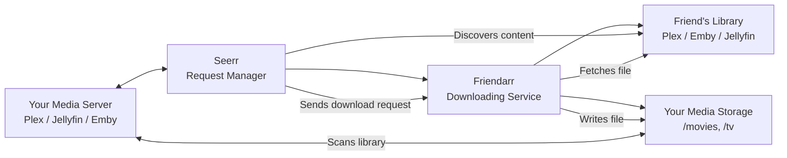
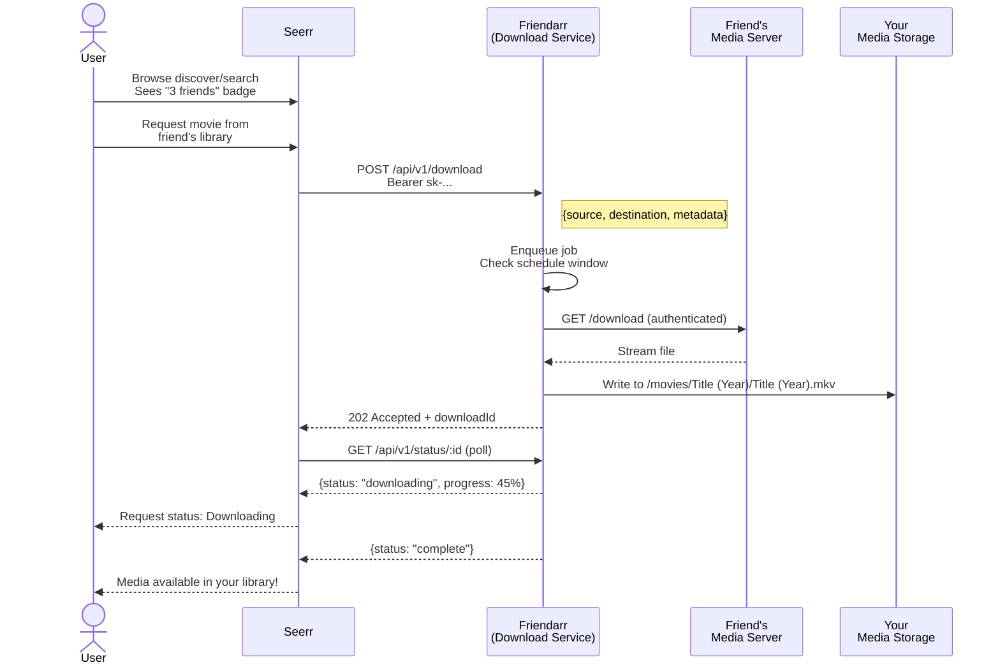

<p align="center">
  <h1 align="center">
    Friendarr
  </h1>
  <p align="center">
    Standalone downloading microservice for Friend Libraries
  </p>
</p>

<p align="center">
  <a href="https://chaosloth.github.io/friendarr/"></a>
  
  
</p>

**Friendarr** is the download companion to [Seerr](https://github.com/seerr-team/seerr)'s **Friend Libraries** feature. Seerr discovers media on your friends' remote libraries (Plex, Emby, Jellyfin). When you request something from a friend, Seerr hands the download job to Friendarr. Friendarr pulls the file from the remote server and places it into your local media library.

**[Read the full documentation →](https://chaosloth.github.io/friendarr/)**

## Screenshots

<p align="center">
  
  
  <br/>
  
</p>

## How It Fits Together



- **Seerr** handles the full request lifecycle — discovery, approvals, user management, notifications.
- **Friendarr** is a lightweight companion that only does one thing: download files from friend libraries.
- They communicate over a REST API authenticated with API keys.

## Request Flow



## Quick Start

### Docker

```bash
docker pull conno/friendarr:latest
docker run -d \
  -p 5056:5056 \
  -e API_KEY=your-master-key-here \
  -e COMPLETED_PATH=/downloads/complete \
  -e INCOMPLETE_PATH=/downloads/incomplete \
  -v /path/to/your/downloads:/downloads:rw \
  -v ./config:/app/config \
  conno/friendarr:latest
```

### Manual

```bash
git clone https://github.com/chaosloth/friendarr.git
cd friendarr
pnpm install
cp .env.example .env
# edit .env with your API_KEY
pnpm build
pnpm start
```

Open **http://localhost:5056** and enter your master API key.

## Documentation

Full documentation with configuration, API reference, file placement, and source setup: **[chaosloth.github.io/friendarr](https://chaosloth.github.io/friendarr/)**

## Development

```bash
pnpm install
pnpm dev        # watch mode: auto-recompile + restart
pnpm typecheck  # TypeScript check without emitting
pnpm lint       # ESLint
pnpm format     # Prettier
```

See the [documentation](https://chaosloth.github.io/friendarr/) for the full architecture overview and contributing guide.

## License

[MIT](./LICENSE)
