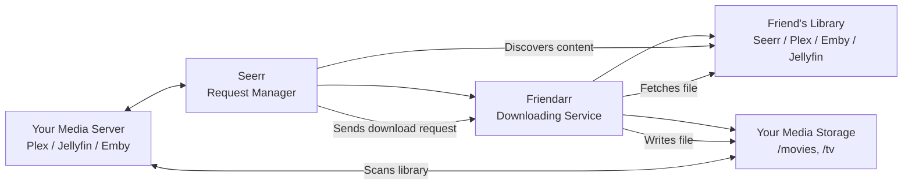
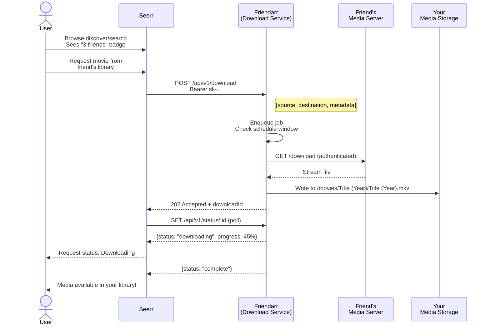
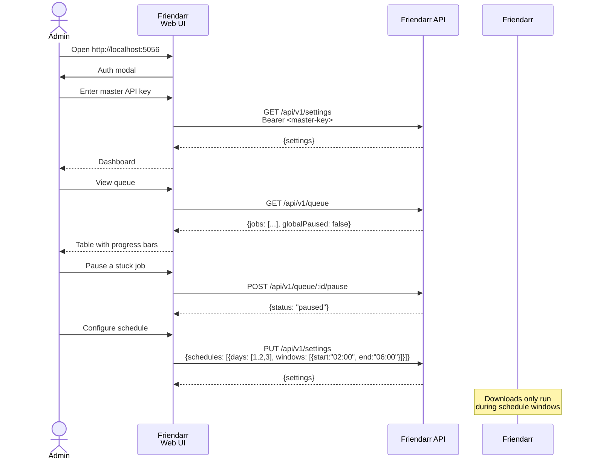

<p align="center">
  <h1 align="center">Friendarr</h1>
  <p align="center">
    Standalone downloading microservice for Friend Libraries
  </p>
</p>

<p align="center">
  
  
</p>

**Friendarr** is the download companion to [Seerr](https://github.com/seerr-team/seerr)'s **Friend Libraries** feature. Seerr discovers media on your friends' remote libraries (Seerr, Plex, Emby, Jellyfin). When you request something from a friend, Seerr hands the download job to Friendarr. Friendarr pulls the file from the remote server and places it into your local media library using the correct folder structure.

## How It Fits Together



- **Seerr** handles the full request lifecycle — discovery, approvals, user management, notifications.
- **Friendarr** is a lightweight companion that only does one thing: download files from friend libraries.
- They communicate over a REST API authenticated with API keys.

## Request Flow

### 1. User requests media from a friend's library



### 2. Admin manages the download queue via Web UI



## Quick Start

### Docker (recommended)

```bash
docker pull conno/friendarr:latest
docker run -d \
  -p 5056:5056 \
  -e API_KEY=your-master-key-here \
  -e COMPLETED_PATH=/downloads/complete \
  -e INCOMPLETE_PATH=/downloads/incomplete \
  -v /path/to/your/downloads:/downloads:rw \
  conno/friendarr:latest
```

### Docker Compose (development)

```bash
docker compose up -d
```

UI at `http://localhost:5056`, API at `http://localhost:5056/api/v1`.

### Manual

```bash
git clone https://github.com/seerr-team/friendarr.git
cd friendarr
pnpm install
cp .env.example .env
# edit .env with your API_KEY
pnpm build
pnpm start
```

## Environment Variables

| Variable | Default | Purpose |
|---|---|---|
| `PORT` | `5056` | Listen port |
| `API_KEY` | — | Master key for UI and API key management |
| `INCOMPLETE_PATH` | `/downloads/incomplete` | Directory for in-progress downloads |
| `COMPLETED_PATH` | `/downloads/complete` | Root directory for completed media |
| `MAX_CONCURRENT_DOWNLOADS` | `2` | Initial max parallel downloads |

All settings (concurrency, bandwidth, schedules, source endpoints) can be changed at runtime via the web UI or `PUT /api/v1/settings`.

## API Reference

### Public endpoints

| Method | Path | Auth | Purpose |
|--------|------|------|---------|
| `GET` | `/health` | None | Health check |
| `GET` | `/api/v1/health` | None | Health check + active download count |

### API key endpoints (any valid API key)

| Method | Path | Auth | Purpose |
|--------|------|------|---------|
| `POST` | `/api/v1/download` | Bearer API key | Queue a download |
| `GET` | `/api/v1/status/:downloadId` | Bearer API key | Track download progress |

### Master key endpoints (master API key only)

| Method | Path | Purpose |
|--------|------|---------|
| `GET` | `/api/v1/queue` | List all jobs + global paused state |
| `POST` | `/api/v1/queue/:id/pause` | Pause a job |
| `POST` | `/api/v1/queue/:id/resume` | Resume a job |
| `DELETE` | `/api/v1/queue/:id` | Cancel a job |
| `DELETE` | `/api/v1/queue` | Clear completed/failed jobs |
| `POST` | `/api/v1/queue/pause-all` | Globally pause queue |
| `POST` | `/api/v1/queue/resume-all` | Globally resume queue |
| `GET` | `/api/v1/settings` | Get runtime settings |
| `PUT` | `/api/v1/settings` | Update runtime settings |
| `POST` | `/api/v1/api-keys` | Create API key |
| `GET` | `/api/v1/api-keys` | List API keys |
| `DELETE` | `/api/v1/api-keys/:key` | Revoke API key |

### Download request format

```json
{
  "source": {
    "type": "seerr | plex | emby | jellyfin",
    "url": "https://friend-server.example.com",
    "authToken": "...",
    "deviceId": "Seerr-script",
    "mediaId": "123",
    "ratingKey": "456"
  },
  "destination": {
    "libraryPath": "/media/movies",
    "mediaType": "movie | tv",
    "title": "Movie Title",
    "year": 2024,
    "tmdbId": 123456
  },
  "metadata": {
    "nfo": true,
    "poster": true,
    "fanart": true
  }
}
```

## Source Support

| Source | Auth | Download Method |
|---|---|---|
| Seerr | `X-Api-Key` header | Direct download endpoint |
| Plex | `X-Plex-Token` header | Two-step: resolve media parts → download, multi-part concat via `PassThrough` |
| Emby | `MediaBrowser` auth header | Direct download endpoint |
| Jellyfin | `MediaBrowser` auth header | Direct download endpoint |

## File Placement

```
/movies/Movie Title (Year)/
  Movie Title (Year).mkv

/tv/Show Title/
  Season 01/
    Show Title - S01E01.mkv
```

## Schedule Gating

Download schedules restrict queue processing to specific time windows. If no schedules are configured, downloads run at any time.

```json
{
  "schedules": [
    {
      "days": [1, 2, 3, 4, 5],
      "windows": [
        { "start": "02:00", "end": "06:00" }
      ]
    }
  ]
}
```

Configure schedules via the web UI or `PUT /api/v1/settings`.

## Web UI

Served at `/`. Authenticate with your master API key to:

- **Queue** — view all jobs with status badges, progress bars; pause/resume/cancel individual jobs; pause/resume all; clear finished
- **Settings** — API keys, source endpoints, concurrency/bandwidth limits, download schedules with multiple time windows per day

## Development

```bash
pnpm dev        # watch mode: auto-recompile + restart
pnpm typecheck  # TypeScript check without emitting
pnpm lint       # ESLint
pnpm format     # Prettier
```

## Architecture

```
src/
├── index.ts              Express server (port 5056, serves UI at /)
├── logger.ts             Seerr-themed colored console logger
├── config.ts             Environment config (dotenv)
├── auth.ts               Bearer auth (master key + generated API keys)
├── types.ts              DownloadRequest, DownloadJob, ApiKey
├── settings.ts           Runtime settings (concurrency, bandwidth, schedules, endpoints)
├── routes/api.ts         All REST endpoints
├── lib/queue.ts          Download queue (schedule gating, pause/resume/cancel)
├── lib/file-placer.ts    File placement (Plex/Jellyfin/Emby folder conventions)
├── sources/seerr.ts      Seerr download adapter
├── sources/plex.ts       Plex download adapter (multi-part concat)
├── sources/emby-jellyfin.ts  Emby/Jellyfin download adapter
└── ui/index.html         Seerr-styled SPA (queue + settings)
```

No external database — all data (jobs, API keys, settings) lives in memory.

## License

[LICENSE](./LICENSE)
