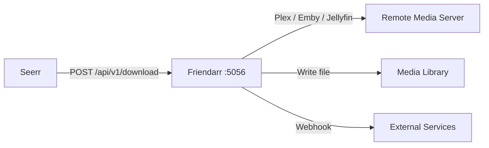
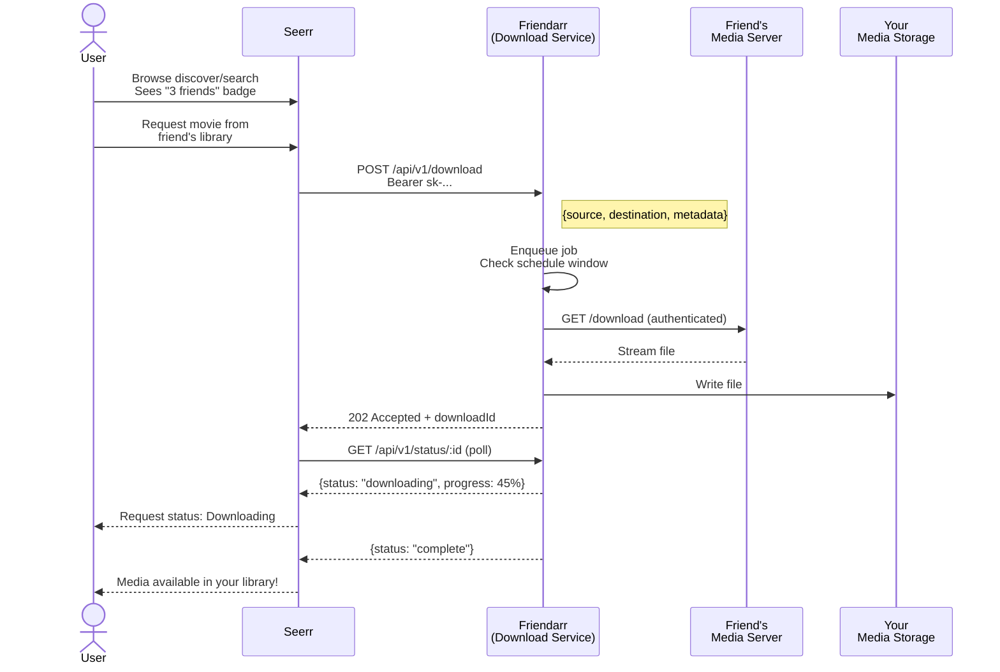

## Architecture

Friendarr is a standalone Express microservice that receives download requests from Seerr (or any HTTP client), connects to the remote media server, downloads the file, and places it in the correct library directory.



- **Seerr** handles the full request lifecycle — discovery, approvals, user management, notifications
- **Friendarr** is a lightweight companion that only does one thing: download files from friend libraries
- They communicate over a REST API authenticated with API keys

## Request Flow



## Screenshots

<div class="screenshots-grid">
  <div>
    
    <p><strong>Setup Wizard</strong> — language selection on first launch</p>
  </div>
  <div>
    
    <p><strong>Queue Dashboard</strong> — monitor and manage downloads</p>
  </div>
  <div>
    
    <p><strong>Settings</strong> — configure sources, schedules, and paths</p>
  </div>
  <div>
    
    <p><strong>Logs Viewer</strong> — real-time server log tail</p>
  </div>
</div>

## Quick Start

```bash
# Clone and install
git clone https://github.com/chaosloth/friendarr.git
cd friendarr
pnpm install

# Configure
cp .env.example .env
# Edit .env — set API_KEY to a secure random string

# Build and run
pnpm build
pnpm start
```

Open **http://localhost:5056** and enter your master API key to access the dashboard.

## Docker

```bash
docker run -d \
  -p 5056:5056 \
  -v /path/to/downloads:/downloads:rw \
  -v ./config:/app/config \
  conno/friendarr:latest
```
